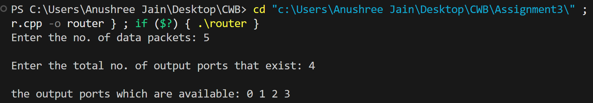
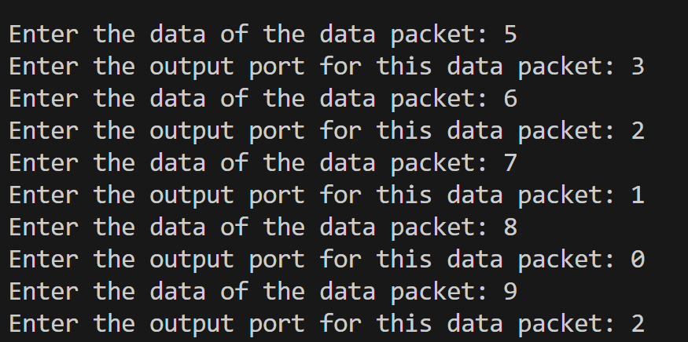
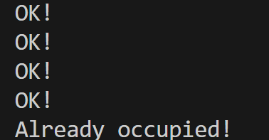
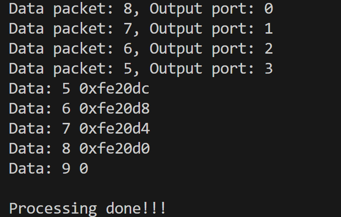

## CWB_A3
<h1 align="center">Simulation Of A Basic Network Device</h1>

  

<h2>Various data structures used are: </h2>
<ul>
  <li>Array-for output ports</li>
  <li>Queue of Node-for the data packets and it's connection</li>
  <li>Queue-for congestion</li>
  <li>Stack-as a call stack for various functions</li>
</ul>
 
<h2>Procedure:</h2>
<h3>We first of all take the total count of data packets and the output ports.</h3>

<h3>The next step to input the data packets and the output ports.</h3>

<h3>Furthur we do the check for congestion in the network.</h3>

<h3>Finally we transfer the packets and then print data packet and output port
<ul>
  <li>The way user entered</li>
  <li>Actually how the packets are stored</li>
</ul></h3>
 
 
 <h2>Now the user can do this simulation using this repo by</h2>
 <h3>
 <ol>
   <li>Cloning this repo using- git clone</li>
   <li>Then just rendering to the router.cpp file</li>
   <li>Finally clicking on run!✔️</li>
 </ol></h3>

